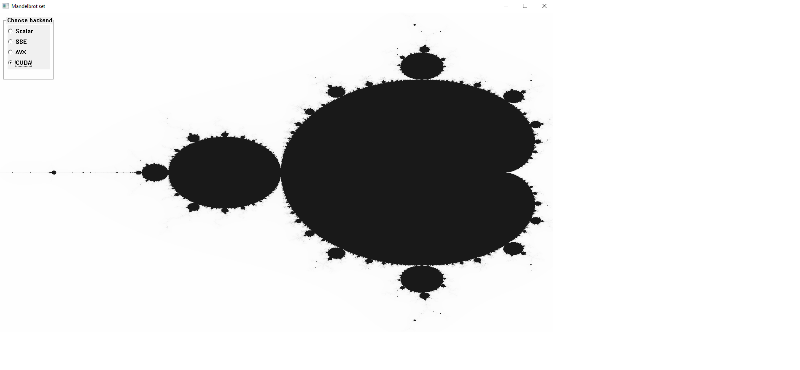

# Mandelbrot
Simple windows GUI application which draws the mandelbrot set with a few different implementations. Different backends
have been written. You can choose between normal scalar, SSE, AVX and CUDA backends.



# Building

## Prerequisite

* Windows
* Visual Studio 20XX
* CUDA Toolkit installed
* SSE and AVX supported CPU

## Build

You will need to to set the correct `CMAKE_CUDA_ARCHITECTURES`. You can find about it more [here](https://developer.nvidia.com/cuda-gpus)

``` sh
cmake -S . -B build -DCMAKE_CUDA_ARCHITECTURES="<your architecture>" ..
cmake --build build
```